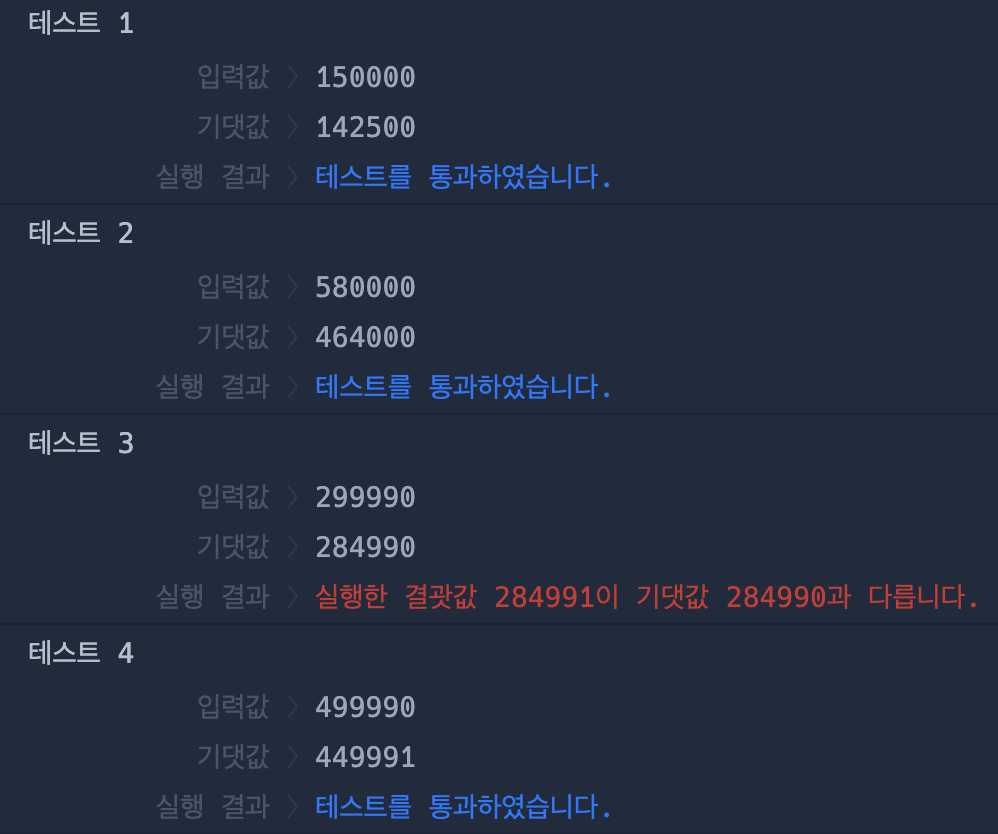

## programmers 입문 저장소

<h4>23.09.18 
: macOS 자바 환경 세팅, VSCode, Git 연동
</h4>

<h4>23.09.19 
: 프로그래머스 Day3 문제 풀이
</h4>

<h4>23.09.20 
: 프로그래머스 Day4 문제 풀이
</h4>

<h4>23.09.21 
: 프로그래머스 Day5 문제 풀이 & 에러케이스 분석
</h4>

<h4>
변경 전 코드에서 에러케이스 발견 
`284990.5` 라는 결과값이 int 형변환을 했을 때 반올림이 수행되어 `284991` 결과로 변경 
기대하는 결과값 `284990`을 만들기 위해서 방법은 두가지 
</h4>

1. Math 클래스를 사용해 소수점 이하는 제거
2. 할인가격을 구해서 원가격을 빼는 코드를 원가격에 할인율을 적용하는 코드로 변경
 
2번째 방법 선택함.

<h4>23.09.24 
: 프로그래머스 Day6 & Day7 문제풀이 & 문자와 문자열 비교 아이디어
</h4>
<h4>
문자열의 문자 `하나`와 문자열을 비교했을 때 타입 오류가 발생 
이 문제를 해결하기 위해 `Character.toString().matches()`를 활용할수도 있지만 `내장 라이브러리` 사용보다는 직관적인 방법을 사용하고 싶어 문자열 -> 문자로 치환 후 비교
</h4>

<h4>23.09.26 
: 프로그래머스 Day8 문제풀이 & 오류케이스 분석
</h4>
<h4>
Day8_2 문제를 처음 시도할 때는 입력받은 정수를 문자열로 바꾸지 않고 정수 그대로 사용해 답을 구하려고 했다.
이렇게 해결하려면 몫과 나머지를 잘 응용해서 해결해야한다. 여기서 문제는 나누었을 때 몫이 `10`,`20`,`90`,`100` 처럼 나올 때 처리를 해주어야 한다.
몫이 한 자리로 `2`,`5`,`9`로 딱 떨어지면 문제가 없지만 문제에서 주어진 입력값의 범위가 딱 떨어지게 주어지지 않았다.
</h4>
<h4>
이러면 조건이 길어지고 내가 만들려고 하는 로직이 복잡해진다.
그래서 처음 입력받은 정수 값을 문자열로 변경해서 한 자리씩 뽑아내 비교하는 로직으로 변경하니 훨씬 간결해져 이 방법을 사용했다.
</h4>
<h4>
정수 그대로 사용해서 몫과 나머지를 compact 하게 응용할 수 있다면 좋겠지만 거기까지 생각이 미치진 못했다.
</h4>
<h4>
Day8_3 문제를 처음 시도할 때는 반복문만을 이용해 푸려고 했는데 비슷한 구조의 순회가 반복되니 재귀를 사용해야겠다라고 생각을 바꾸었다.
</h4>
<h4>
재귀를 사용할 때 핵심은 `상태 값 정의`,`종료 조건`,`점화식` 3가지 이다.
처음부터 완벽한 아이디어가 떠올라 3가지 핵심이 작성되지는 않았고 1가지씩 정의를 해보고 테스트케이스를 시뮬레이션 해보니 필요한것과 수정되어야할것들이 떠올라 10번 정도 수정하니 기본 골조가 만들어졌다.
</h4>
<h4>
그렇게 기본 구조를 기반으로 로직을 작성했고 마지막 상태를 정의해주지 않아 오류가 있었고 마지막 상태를 정의해주고 실행하니 문제가 해결되었다.
</h4>
<h4>
Day8_3 문제를 풀어낸 로직의 시간 복잡도는 O(N+M)이다. 마지막 상태 정의를 효율적으로 할 수 있는 방법이 없을까 고민해보았지만 생각이 미치지 못해 O(N) 형태로 만들지 못했다.
</h4>

<h4>23.09.27 
: 프로그래머스 Day9 문제 풀이 & 오류 케이스 분석
</h4>
<h4>
Day9_4 문제풀이 중 경험한 오류케이스 분석 내용 작성
</h4>

<h4>
첫 시도는 팩토리얼 함수 만들면 되겠구나!
문제에 Hint 로 주어진 공식과 함께 재귀함수를 만들어 전체 로직을 완성 후 테스트 케이스 실행 성공! 이제 제출만 하면 끝이구나!
`But` 실행결과에 주어지는 실패 목걸이 .... 실패가 엄청 많이 발생했다.
</h4>
<h4>
그래서 오류 케이스를 분석을 시작 항상 오류 분석은 입력값의 최소사양과 최대사양을 고려해보고 이것으로도 해결이 안되면 중간 값으로 해결을 시도한다.
최소사양과 최대사양부터 문제가 발견돼 수정하고 중간 값만 해결해주면 성공 할 것 같았다! 하지만 중간 값을 처리하는데 `BigInteger`,`Long` 을 사용하게 되었고 코드가 길어지고 구조가 복잡해지기 시작! Level 0 문제가 이렇게 어렵게 풀이된다는게 말이 안된다!
</h4>
<h4>
결국, 제출했을 때 실행 결과 중 18개 성공 12개 실패를 기록하고 답을 찾아보았다... 너무 코드가 간단해서 허무했다...
모두가 combination() 재귀 함수를 작성해 조합했다.. 하지만, 정확히 이해가 되지 않아 다른 풀이를 서치하던 중 나와 똑같은 접근방법을 시도한 사람이 있다!
</h4>

`https://ulmu0426.tistory.com/6`

<h4>
코드도 엄청 간단하다 나랑 접근방법이 똑같은데 어떻게 이렇게 간단하게 작성했지? 생각하며 코드를 확인하니 재귀를 사용하지 않고 반복문 1개로 해결....
내가 고생한 로직과 비교해보니 나는 재귀를 어떻게든 사용해서 끼워맞추려고 시도하다보니 재귀함수를 위한 코드 구조가 만들어져 코드 길이가 길어지고 구조가 점점 복잡해지는것이었다....

좋은 접근방법을 생각했지만 `팩토리얼은 재귀를 사용해야 돼!`라는 강박관념에 사로잡혀 관점을 다르게 해석하려하지 못했다...

이 문제는 계속 복습해보면서 익숙해져야겠다.... 개인적으로 조합 관련 유형이 매우 약한 것 같아 관련 유형 문제를 많이 접해야겠다.
</h4>

