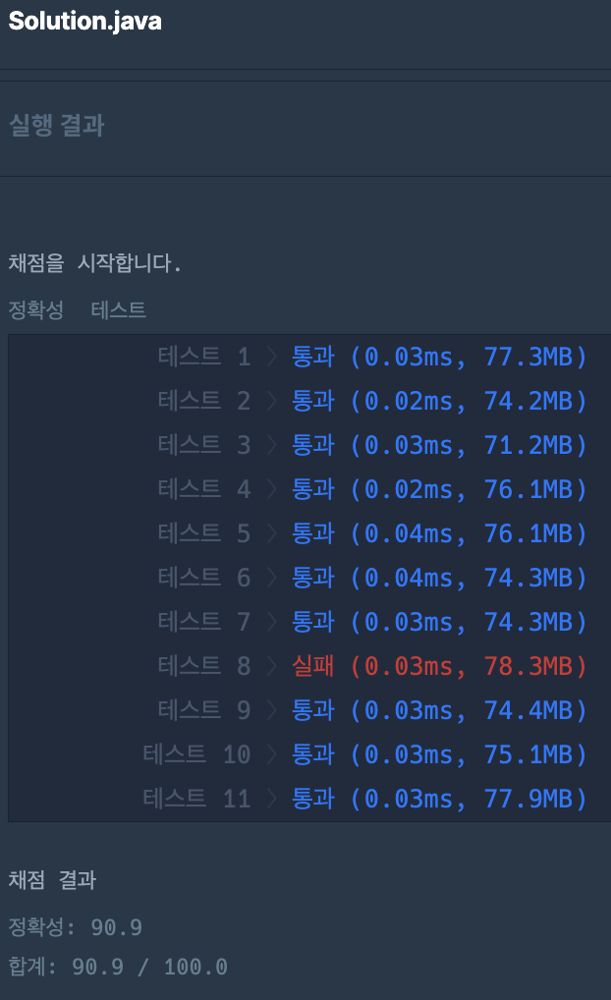

## programmers 입문 저장소

<p>
<h4>[23.09.18]<br/>
: macOS 자바 환경 세팅, VSCode, Git 연동
</h4>
</p>

<p>
<h4>[23.09.19]<br/>
: 프로그래머스 Day3 문제 풀이
</h4>
</p>

<p>
<h4>[23.09.20]<br/>
: 프로그래머스 Day4 문제 풀이
</h4>
</p>

<p>
<h4>[23.09.21]<br/>
: 프로그래머스 Day5 문제 풀이 & 에러케이스 분석
</h4>


<h4>
변경 전 코드에서 에러케이스 발견<br/>
`284990.5` 라는 결과값이 int 형변환을 했을 때 반올림이 수행되어 `284991` 결과로 변경<br/>
기대하는 결과값 `284990`을 만들기 위해서 방법은 두가지<br/>
</h4>

1. Math 클래스를 사용해 소수점 이하는 제거
2. 할인가격을 구해서 원가격을 빼는 코드를 원가격에 할인율을 적용하는 코드로 변경
<br/>
2번째 방법 선택함.
</p>

<p>
<h4>[23.09.24]<br/>
: 프로그래머스 Day6 & Day7 문제풀이 & 문자와 문자열 비교 아이디어
</h4>
<h4>
문자열의 문자 `하나`와 문자열을 비교했을 때 타입 오류가 발생<br/>
이 문제를 해결하기 위해 `Character.toString().matches()`를 활용할수도 있지만 `내장 라이브러리` 사용보다는 직관적인 방법을 사용하고 싶어 문자열 -> 문자로 치환 후 비교
</h4>
</p>

<p>
<h4>[23.09.26]<br/>
: 프로그래머스 Day8 문제풀이 & 오류케이스 분석
</h4>
<h4>
Day8_2 문제를 처음 시도할 때는 입력받은 정수를 문자열로 바꾸지 않고 정수 그대로 사용해 답을 구하려고 했다.
이렇게 해결하려면 몫과 나머지를 잘 응용해서 해결해야한다. 여기서 문제는 나누었을 때 몫이 `10`,`20`,`90`,`100` 처럼 나올 때 처리를 해주어야 한다.
몫이 한 자리로 `2`,`5`,`9`로 딱 떨어지면 문제가 없지만 문제에서 주어진 입력값의 범위가 딱 떨어지게 주어지지 않았다.
</h4>
<h4>
이러면 조건이 길어지고 내가 만들려고 하는 로직이 복잡해진다.
그래서 처음 입력받은 정수 값을 문자열로 변경해서 한 자리씩 뽑아내 비교하는 로직으로 변경하니 훨씬 간결해져 이 방법을 사용했다.
</h4>
<h4>
정수 그대로 사용해서 몫과 나머지를 compact 하게 응용할 수 있다면 좋겠지만 거기까지 생각이 미치진 못했다.
</h4>
<h4>
Day8_3 문제를 처음 시도할 때는 반복문만을 이용해 푸려고 했는데 비슷한 구조의 순회가 반복되니 재귀를 사용해야겠다라고 생각을 바꾸었다.
</h4>
<h4>
재귀를 사용할 때 핵심은 `상태 값 정의`,`종료 조건`,`점화식` 3가지 이다.
처음부터 완벽한 아이디어가 떠올라 3가지 핵심이 작성되지는 않았고 1가지씩 정의를 해보고 테스트케이스를 시뮬레이션 해보니 필요한것과 수정되어야할것들이 떠올라 10번 정도 수정하니 기본 골조가 만들어졌다.
</h4>
<h4>
그렇게 기본 구조를 기반으로 로직을 작성했고 마지막 상태를 정의해주지 않아 오류가 있었고 마지막 상태를 정의해주고 실행하니 문제가 해결되었다.
</h4>
<h4>
Day8_3 문제를 풀어낸 로직의 시간 복잡도는 O(N+M)이다. 마지막 상태 정의를 효율적으로 할 수 있는 방법이 없을까 고민해보았지만 생각이 미치지 못해 O(N) 형태로 만들지 못했다.
</h4>
</p>

<p>
<h4>[23.09.27]<br/>
: 프로그래머스 Day9 문제 풀이 & 오류 케이스 분석
</h4>


<h4>
Day9_4 문제풀이 중 경험한 오류케이스 분석 내용 작성
</h4>

<h4>
첫 시도는 팩토리얼 함수 만들면 되겠구나!
문제에 Hint 로 주어진 공식과 함께 재귀함수를 만들어 전체 로직을 완성 후 테스트 케이스 실행 성공! 이제 제출만 하면 끝이구나!
`But` 실행결과에 주어지는 실패 목걸이 .... 실패가 엄청 많이 발생했다.
</h4>

<h4>
그래서 오류 케이스를 분석을 시작 항상 오류 분석은 입력값의 최소사양과 최대사양을 고려해보고 이것으로도 해결이 안되면 중간 값으로 해결을 시도한다.
최소사양과 최대사양부터 문제가 발견돼 수정하고 중간 값만 해결해주면 성공 할 것 같았다! 하지만 중간 값을 처리하는데 `BigInteger`,`Long` 을 사용하게 되었고 코드가 길어지고 구조가 복잡해지기 시작! Level 0 문제가 이렇게 어렵게 풀이된다는게 말이 안된다!
</h4>

<h4>
결국, 제출했을 때 실행 결과 중 18개 성공 12개 실패를 기록하고 답을 찾아보았다... 너무 코드가 간단해서 허무했다...
모두가 combination() 재귀 함수를 작성해 조합했다.. 하지만, 정확히 이해가 되지 않아 다른 풀이를 서치하던 중 나와 똑같은 접근방법을 시도한 사람이 있다!
</h4>

`https://ulmu0426.tistory.com/6`

<h4>
코드도 엄청 간단하다 나랑 접근방법이 똑같은데 어떻게 이렇게 간단하게 작성했지? 생각하며 코드를 확인하니 재귀를 사용하지 않고 반복문 1개로 해결....
내가 고생한 로직과 비교해보니 나는 재귀를 어떻게든 사용해서 끼워맞추려고 시도하다보니 재귀함수를 위한 코드 구조가 만들어져 코드 길이가 길어지고 구조가 점점 복잡해지는것이었다....

좋은 접근방법을 생각했지만 `팩토리얼은 재귀를 사용해야 돼!`라는 강박관념에 사로잡혀 관점을 다르게 해석하려하지 못했다...

이 문제는 계속 복습해보면서 익숙해져야겠다.... 개인적으로 조합 관련 유형이 매우 약한 것 같아 관련 유형 문제를 많이 접해야겠다...
</h4>
</p>

<p>
<h4>[23.09.29]<br/>
: 프로그래머스 Day10 문제 풀이
</h4>
<h4>
Day10_3 문제풀이 중 `k`번째 인덱스번호와 상관관계를 생각해내는게 어려웠는데 노트에 입력값을 직접 작성해보며 결과값을 확인해보니 패턴이 발견되어 해결 할 수 있었다.
</h4>
</p>

<p>
<h4>[23.09.30]<br/>
: 프로그래머스 Day11 문제 풀이
</h4>
</p>

<p>
<h4>[23.10.01]<br/>
: 프로그래머스 Day12 문제 풀이 & 오류케이스 분석
</h4>
<h4>
Day12_1 문제풀이 중 첫 접근은 분기문의 'aeiou' 를 모두 검사 후 'my_string' 변수의 대입하는 로직이었다.
여기서 문제가 발생한다! 해당 로직을 수행하는 반복문은 'my_string' 길이 만큼 반복을 수행하는 데 my_string 변수 길이가 줄어드는 로직이 수행되다보니 `OutOfIndex`가 발생했다.
이것을 해결하기 위해 'my_string' 길이만큼 반복하는 로직을 'aeiou'를 가지는 문자열 변수를 새롭게 선언하고 해당 변수와 my_string 변수의 문자를 하나씩 비교하는 반복문을 사용하니 위 문제가 해결되었다.
</h4>
<h4>
Day12_4 문제풀이 중 첫 접근은 반복문 하나를 사용해 `i`값이 증가하면서 소인수를 찾아가게 하는 로직이었다. 여기서 문제는 소인수가 반복될 수 있다는 것이다. 예를 들면, 2로 나누었을 때 6이 몫이라면 다시 2로 나누는 수행을 진행해야한다.
하지만, 일반적인 반복문은 `i`값을 하나씩 증가해 수행하기 때문에 문제가 생긴것이다.
그래서 일반 반복문은 사용하기 어렵다라고 판단한 후 재귀를 사용해 풀어봐야겠다라는 접근법을 떠올리고 재귀의 핵심 `상태 값`,`종료조건`,`점화식` 3가지를 고려해서 시뮬레이션 해보니 가능하다고 판단했다.
<br/>
<br/>
이 문제는 소인수가 중복으로 결과 배열의 저장되면 안되기 때문에 'HashSet' 자료구조를 활용했고 마지막 결과는 'int[]'와 같은 자료구조를 사용하기 때문에 배열로 변환하는 로직도 추가했다. 그리고 제출을 해보니 1개의 결과가 오류 나머지는 통과였다. 딱! 1개만 오류가 뜨는 이유를 찾아보기 위해 테스트케이스를 하나씩 추가해가며 찾아가보았고 '9999' 의 자연수를 입력해보니 `[3,101,11]`과 같이 정렬 안되어 결과가 출력되고 있었다.
`Arrays.sort()` 내장 함수를 사용해 `[3,11,101]`로 변경하는 로직을 추가하니 위 문제가 해결되었다.
</h4>
</p>

<p>
<h4>[23.10.03]<br/>
: 프로그래머스 Day13 문제 풀이 & 오류케이스 분석
</h4>
<h4>
Day13_3 문제 풀이 중 첫 접근은 입력된 문자열을 순회하면서 재귀를 호출해 중복된 문자를 제거하고 중복에 사용된 문자를 앞자리에 붙여 다시 재귀를 호출하는 것으로 시도했다. 엄청난 삽질 끝에 재귀를 이옹해서 결과를 만들지 못했고 답을 찾아보게 되었는데 너무 간단히 답을 만들어냈다.
</h4>
<h4>
해결방안은 결과 문자열의 문자를 하나씩 추가하면서 포함되어있는 문자라면 추가하지 않는 로직인 것이다. 재귀를 사용해서도 풀 수 있겠지만 재귀를 위한 코드 구조를 만들려고하니 굉장히 복잡해지고 나중에는 어디가 문제인지 찾기가 너무 어려웠다... 재귀에만 매몰되어 있지말자... 시간이 1시간 이상 지체되면 답을 보자...
</h4>


<h4>
Day13_4 문제 풀이 중 15개 정도 테스트 케이스를 작성해 실행했을 때 문제가 없는데 제출만 하면 실패한다... 이유를 찾던 중 만약에 정수 배열의 요소가 모두
같다면 예를 들어, [987,987,987] 이라면 문제의 제한사항을 고려했을 때 완전한 삼각형이 될 수 있어야 한다. 하지만, 내가 만든 로직에서는 세 변이 같을 때 처리를 해주지 않았다. 세변이 같을 때 처리도 로직을 추가하니 통과 되었지만 'Arrays.sort()' 내장 라이브러리를 사용해 오름차순 정렬 후 로직을 변경하니 간단히 변경할 수 있었다.
</h4>
</p>

<p>
<h4>[23.10.04]<br/>
: 프로그래머스 Day14 문제 풀이
</h4>
<h4>
Day14_4 문제 풀이 중 아스키코드를 활용해서 풀게 되었는데 코딩테스트 준비를 위해 읽고 있는 책을 참고해 한번 더 생각해보자!
</h4>
</p>

<p>
<h4>[23.10.05]<br/>
: 프로그래머스 Day15 문제 풀이 & 오류 케이스 분석
</h4>


<h4>
Day15_1 문제 풀이 중 첫 접근은 `HashMap`을 사용해 foreach 반복문을 수행해 문자열이 포함되어 있다면 변경하는 것으로 진행했다.
하지만, `HashMap` 변수는 순서가 보장되지 않았고 보장이 되더라도 `14067`이 결과로 만들어져야 되는 문자열은 `01467`과 같이 순서가 이상해지는 이슈가 있었다.
위 이슈는 'replaceAll()' 내장 함수를 사용하는 것으로 바꾸니 해결되었다.
</h4>
<h4>
하지만, 제출하니 런타임 에러가 3개 발생했다.... 왜? 시간복잡도 문제인가 공간복잡도 문제인가 생각하며 자료구조도 바꿔보고 코드 길이도 줄여보고 별 짓을 다했지만 결국 답을 보았고 답에서 결과를 리턴하기 전 'Integer.parseInt()'로 바꾸는 것이 문제였다... 'Long.parseLong()'으로 변경 후 제출하니 해결되었다.... return 구조가 long 인걸 확인했어야 했는 데 크게 신경쓰지 않았던 부분에서 문제가 생겼던 것이다.
</h4>
<h4>
새롭개 알게된 정보가 있다! 람다식을 이용한 foreach문을 사용할 때 지역변수만 사용 가능하고 전역변수를 불러올 수 없는 이슈가 있었다.
</h4>
</p>

<p>
<h4>[23.10.06]<br/>
: 프로그래머스 Day16 문제 풀이 & 오류 케이스 분석
</h4>
<h4>
Day16_3 문제 풀이 중 첫 접근은 너무 막막했다. 숫자와 연산자를 구분은 하겠는데 연산자가 나오기 전 수와 연산자 다음 수를 해당 연산자로 연산해야 하는데 아이디어가 떠오르지 않았다. 그래서 나는 연산자를 기억하는 변수와 연산을 해야하는 수들을 저장하는 리스트를 응용해 답을 만들었다.
하지만, 테스트 케이스는 통과했지만 제출했을 때 오류가 발생한다... 이유는 연산자가 출현하기 전 수와 다음 수를 저장하지 않으면 로직이 꼬이는데 마지막에 출현하는 수는 딱 하나만 있기 때문에 전체적으로 코드 구조를 다시 생각해야했다... 1시간 30분 정도 시간을 소요해서 답을 찾아보았다.
</h4>

<h4>
너무 간단해서 황당했지만... 바로 이해가 되었다.. 해당 문제는 (수 연산자 수 연산자 수 연산자)와 같은 퐁당퐁당 구조이다.
그래서 첫번째 값만 결과 변수의 초기화하고 연산자(+,-)를 만날 때 해당 (인덱스 + 1)한 인덱스 요소를 연산하는걸로 바꾸니 해결되었다..
다시 해석해보자면 연산자가 출현했으니 다음에는 연산에 필요한 수가 나올 것이기에 +1 인덱스 요소를 가져와 연산을 수행한 것이고 다음 인덱스에는 연산자(+,-)가 아니라 숫자가 출현하니 지나가게되는 것이다.
</h4>

<h4>
이렇게 간단한 아이디어가 있는데 나는 왜 찾지 못하는 걸까?? 연습만이 살 길이다....
</h4>

<h4>
Day16_4 문제 풀이 중 `contains()` 함수를 사용하며 생긴 이슈를 작성한다...
</h4>
<h4>
예를들어,

```java
String testA = "abc";
String testB = "c";

System.out.println(testB.contains(testA));
// 1. 위 결과는 false 이다.

System.out.println(testA.contains(testB));
// 2. 위 결과는 true 이다.

// 여기서 알 수 있는 점은 `contains()` 함수 파라미터로 작성된 값 자체가 있는지 없는지를 확인하기 때문에 1번 결과는 "c" 문자열에서 "abc"를 찾기 때문에 false가 결과로 나오는 것이다.
```

위 내용을 크게 고려하지 않고 로직을 작성했더니 자꾸 true 가 아니라 false 가 발생해서 내가 놓쳤던 부분을 정리해본다.
</h4>
<h4>
이중 반복문을 사용하기 싫어 최대한 O(N+M)으로 해결하려 해보았지만 로직이 더 복잡해지고 `contains()` 함수가 아닌 `equals()` 함수를 사용해야되는 상황이라서 이중 반복문으로 코드 구조를 변경해 해결했다.
</h4>
</p>

<p>
<h4>[23.10.07]<br/>
: 프로그래머스 Day17 문제 풀이
</h4>
</p>

<p>
<h4>[23.10.09]<br/>
: 프로그래머스 Day18, 19 문제 풀이
</h4>
<h4>
Day18_4 문제 풀이 중 첫 접근은 입력 값 my_string 길이만큼 순회해서 소문자 검사 후 대문자라면 소문자로 변경하고 문자열을 정렬해주면 끝날거라 생각했다.

아이디어는 틀리지 않았다. 구현을 해보며 필요한 함수를 활용하게 되었는데 입력된 문자열을 순회하며 대문자가 발견되었을 때 해당 문자를 소문자로 변경 후 my_string 문자열의 변경해주어야 하는데 이 작업은 my_string 문자열의 인덱스 번호를 찾고 해당 인덱스 번호를 가지는 문자 값을 변경해주어야 한다.
</h4>

<h4>
이 작업을 위해서 사용할 수 있는 자바 내장 함수는 `substring()`,`toCharArray()`,`StringBuilder()`이다.

<br/>1. `substring()` 함수는 변경하려는 문자 이전 값과 이후 값을 조합해 사용한다.
<br/>2. `toCharArray()` 함수는 변경하려는 문자 인덱스만 알면 해당 인덱스의 대입만 하면된다.
<br/>3. `StringBuilder()` 클래스는 `setCharAt()` 함수를 사용해 변경하려는 인덱스 번호와 문자를 사용하면 된다. 
<br/>
위 방법 중 2번 방법을 사용하는게 해당 문제에서는 가장 간단하게 답을 찾을 수 있는 방법이라 선택해 해결했다.
</h4>

<h4>
Day19_2 문제 풀이 중 첫 접근은 입력된 정수 n을 잘라내어 결과 배열의 저장하고 정수 n으로 딱 잘라지지 않는 나머지 문자열만 분기처리 해주면 끝날거라 생각 후 코드를 작성 후 제출했다.. 하지만, 테스트케이스는 문제없지만 제출했을 때 8개 테스트 케이스 3개에서 오류가 발생했다... 해당 문제를 풀이하는 데 2시간 가까이 소요되어 답을 찾아 보았다.
</h4>

<h4>
답을 볼 때마다 느끼지만 너무 간단한 코드로 답을 만들어내 허무할 정도이다...
입력된 문자열 my_str 을 `substring()` 함수를 사용해 시작 지점과 끝 지점만큼 잘라내 결과 배열의 저장 후 잘라낸 지점 부터 끝까지 my_str 문자열을 재설정 해주고 다음 반복에는 새롭게 설정된 문자열을 기반으로 잘라내는 작업을 수행하는 것이다... 나는 새로운 메서드를 두개 만들어 수행했던 작업을 더 간단히 풀이하는 아이디어가 있었는데 생각해내지 못했다... 복습할 때 다시 고민해보자...
</h4>
</p>

<p>
<h4>[23.10.11]<br/>
: 프로그래머스 Day20 문제 풀이 및 오류케이스 분석
</h4>



<h4>
Day20_2 문제 풀이 중 입력으로 주어지는 board 범위를 벗어나면 안되기 때문에 최소, 최대 범위를 구하고 조건문에서 비교했다..
여기서 테스트케이스 8번에서 오류가 발생하는 데 여러 테스트케이스를 고려해보며 케이스를 만들어보았지만 오류를 알 수 없어 답을 찾아보았다...
하지만, 나와 같은 케이스는 찾을 수 없어 작성한 코드를 다시 훝어보았는데 비교 조건에서 문제가 발견되었다... 나는 모든 방향키 입력에 대해서 최소,최대 범위를 모두 비교 후 통과되면 좌표가 이동되게 로직을 작성했는 데 생각해보니 좌표가 음수로 향할 때는 `최소`범위만, 좌표가 양수로 향할 때는 `최대`범위만 비교하면 될거라 판단했고 이 코드가 테스트케이스 8번에 오류를 만든거라고 생각해 제출해보니 해결되었다....
</h4>

<h4>
Day20_4 문제 풀이 중 처음 의사 코드 작성했던 흐름은 틀리지 않았다..
하지만 동류항끼리만 더할 때, x계수만 따로 분리해야 했고 분리한 후에도 x계수가 1일 때 처리가 필요했다... 또한, 0부터 100사이의 정수를 판별하는 로직이 필요해 함수를 만들어 사용했다... 마지막으로 결과를 만들 때, 5가지로 분기했는데 x계수가 1일 때와 아닐 때 일반 수 값이 0일 때와 아닐 때 결과 값이 달라지는 데 처음에는 3가지 분기만 제출하니 3개 케이스가 오류가 발생했고 분기문을 조금 수정하니 해결되었다...
</h4>
</p>

<p>
<h4>[23.10.12]<br/>
: 프로그래머스 Day21 문제 풀이 & 오류 케이스 분석
</h4>

<h4>
Day21_1 문제 풀이 중 첫 시도는 입력된 문자열 my_string 길이만큼 순회하며 각 문자를 숫자인지 판별하고 숫자일 때 인덱스번호를 기억하며 연속된 숫자가 나올 때 처리를 수행했다. 이 로직이 핵심이었는데 테스트케이스 2개를 통과했지만 제출해보니 10개 케이스 중 6개에서 오류가 발생했다... 시간도 1시간30분정도 사용했고 오류케이스가 너무 많으니 답을 찾아보았다...
</h4>

<h4>
답을 볼 때마다 느끼지만 다른 사람들은 너무 간단히 코드를 작성해 내가 고민한 시간들이 낭비같다고 느껴진다 그래도 고민한만큼 성장한다고 마음을 다잡고...
답의 내용은 입력된 my_string 문자열을 소문자or대문자를 기준으로 나누는것이다.
그러면 문자는 사라지고 숫자만 남는다... 이제 결과를 누적하고 제출하는데 `NumberFormatException`이 발생한다... 왜?? 문자 기준으로 나눌 때 비어있는 문자가 생긴다... 그래서 다항식을 사용해 문자가 비어있을 때와 비어있지 않을 때 처리를 해주니 해결되었다...
</h4>

<h4>
Day21_2 문제 풀이 중 의사코드대로 코드를 만들었을 때, 오류케이스가 발생했다..
입력으로 주어진 `board` 칸 수 만큼 반복해서 지뢰가 발견되면 위험지역으로 표시를 해두는데 이후의 반복이 이루어질 때 위험지역이 전이가 되는 현상이 나타났다...
그래서 위험지역 표시가 전이되지 않는 방법을 고민하다 모르겠어서 답을 찾아보았고 아이디어는 지뢰 정보만 따로 저장하는 리스트를 응용해서 타겟(지뢰)리스트만 반복해 위험지역을 조사하는 것이다. 이렇게 되면 위험지역이 전이되지 않고 타겟(지뢰)한 곳만 위험지역으로 표시할 수 있다.
</h4>
</p>

<p>
<h4>[23.10.13]<br/>
: 프로그래머스 Day22 문제 풀이 & 오류 케이스 분석
</h4>

<h4>
Day22_1 문제 풀이 중 핵심 아이디어는 3의 배수 or 3이 포함되면 마을에서 쓰지 않는 수이고 해당 조건이 아닐 때 마을에서 사용하는 수가 된다.... 여기서 문제는 마을에서 쓰는 숫자가 무엇인지는 알겠는데 답을 제출할 때 주어진 입력 n 이 마을에서 쓰는 숫자와 어떻게 매핑할 수 있는지가 장애물이었다... 고민고민하다 아이디어를 생각못해 답을 찾아 보았다.
</h4>

<h4>
항상 그렇지만 답은 너무 간단하다... 방법은 두가지이다...
<br/>
1.순회시마다 답을 1증가 시키고 증가시킨 답이 3의 배수 or 3이 포함되면 답을 계속 1증가 하는 방법
<br/>
2. 순회시마다 해당 인덱스가 3의 배수 or 3이 포함되면 입력된 정수 n을 1증가시켜 순회범위를 늘리는 것이다... 이게 처음에는 이해가 안되어 수기로 작성해면서 흐름을 따라가니 결국, 입력된 n 의 대응되는 마을에서 쓰는 숫자가 도출된다...
</h4>

<h4>
2번을 선택해 해결하게되었다... 아이디어가 떠오르지 않는게 너무 답답하다...
</h4>

<h4>
Day22_2 문제 풀이 중 첫 접근은 y좌표의 차이와 x좌표의 차이가 같으면 평행선이라는 정의로 시작했지만, 오류가 발생한다... 이유를 찾아보니 `[[0,0],[1,1],[2,2],[3,3]]`이 입력일 때, 내가 작성한 로직에서는 평행으로 판단한다는 것... 하지만, 이 좌표는 평행이 아니다 실제로 좌표를 그려보면 알겠지만 직선끼리 만나게 되어서 평행의 조건과는 맞지 않다... 그래서 어떻게 할까 고민하다가 답을 찾아 보았다... 직선의 기울기를 활용해서 직선이 평행인지 확인할 수 있었다...
</h4>

<h4>
좌표가 똑같을 때는 직선이 겹치는데 이것은 문제 제한사항에서 평행이라고 판단했기 때문에 직선의 기울기 공식을 사용해 조합한 두 직선의 기울기가 같다면 평행이 된다...
이렇게 코드를 변경하니 해결되었다.....
</h4>
</p>